# RBAC and Key Vault: Secure Access by Design

A practical demonstration of least privilege access control in Azure. Three users, three roles, three different scopes, one Key Vault, and the answer to a question most teams get wrong: can an Owner read a secret they own?

Spoiler: no.

---

## Scenario

A small accounting firm in Barcelona is moving its file storage and credentials management to Azure. Three people are involved in the migration: an external IT auditor hired for compliance review, an internal operator responsible for deploying and maintaining the resources, and a billing application that needs to read a database connection string at runtime.

The constraints are typical for a company this size. Limited budget. No dedicated security team. One clear compliance requirement: the auditor must be able to verify the setup without modifying anything or accessing sensitive data. The operator manages infrastructure but must never see the secrets the applications use. The billing application gets exactly one secret, nothing else.

The default approach in most environments would be to give everyone Owner on the subscription and hope for the best. This project shows what the right setup looks like.

---

## Architecture

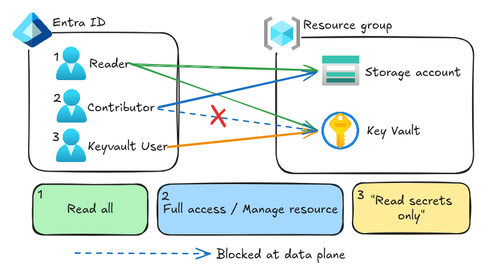

The setup is minimal on purpose. One Resource Group containing a Storage Account and a Key Vault. Three users in Entra ID, each with a different role assigned at a different scope.

---

## The Users

| User | Role | Scope | Should be able to |
|------|------|-------|-------------------|
| `reader-user` | Reader | Resource Group | View all resources, modify nothing |
| `contributor-user` | Contributor | Resource Group | Create, modify, delete resources, but not read secrets |
| `keyvault-user` | Key Vault Secrets User | Key Vault only | Read secrets, see nothing else |

Each user maps to one of the three real roles in the scenario. `reader-user` is the auditor. `contributor-user` is the operator. `keyvault-user` is the billing application's identity.

---

## What Happened in the Lab

### Surprise number one: Owner is not enough

The first thing that broke the lab was my own account. I am Owner at the subscription level. I created the Key Vault. And I could not read the secret I had just created.

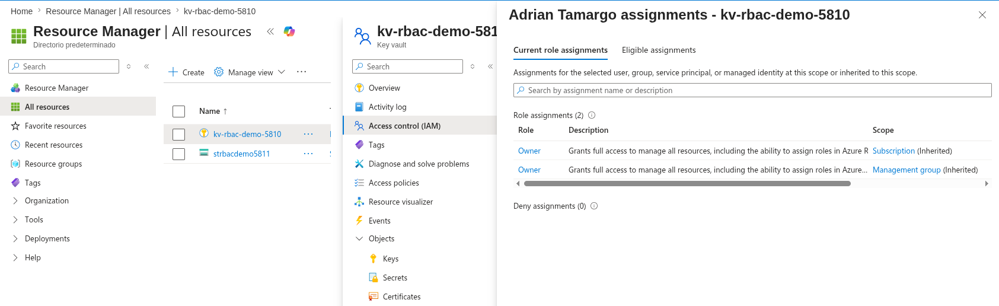

This is the management plane vs data plane separation that AZ-305 keeps asking about. Being Owner of a resource gives you control over the resource itself (you can create it, configure it, destroy it) but it does not automatically grant access to the data inside it.

To read the secret, I had to assign myself the `Key Vault Administrator` role explicitly.

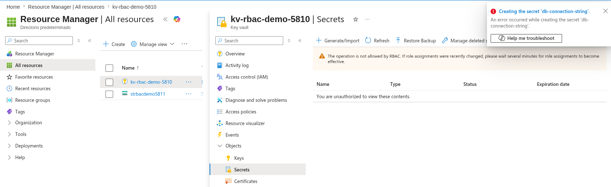

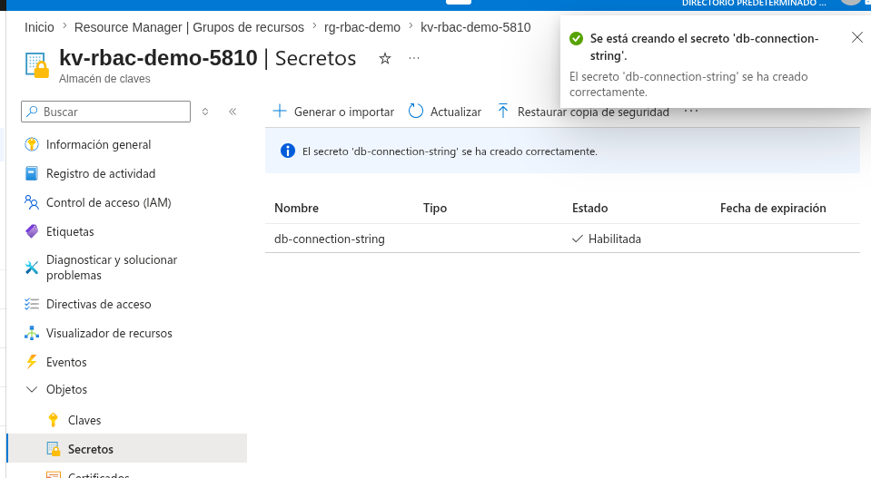

### Reader does exactly what it says

`reader-user` can see the Resource Group, the Storage Account, and the Key Vault. They can browse to every blade in the portal. But the moment they try to do anything (create a container, modify a configuration, read a secret) RBAC blocks them.

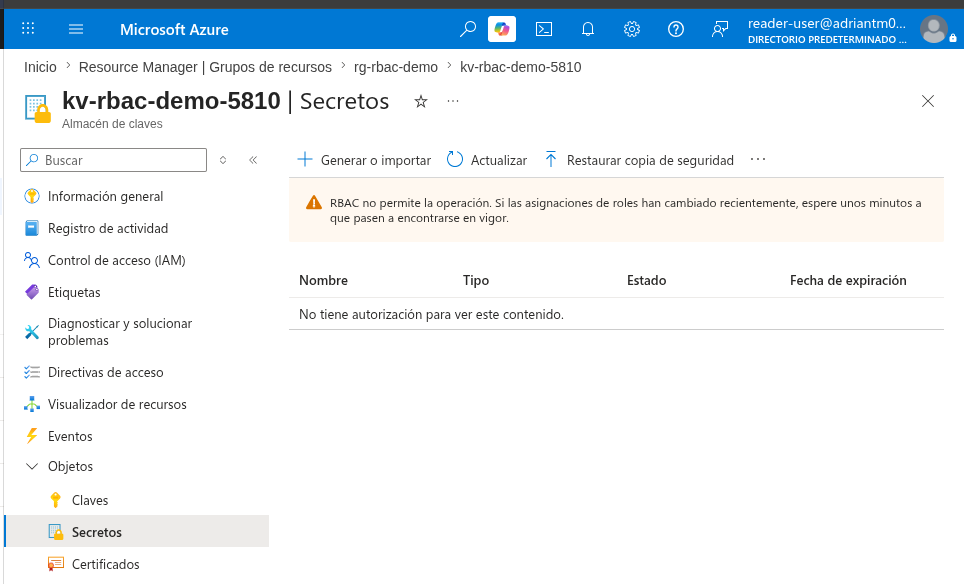

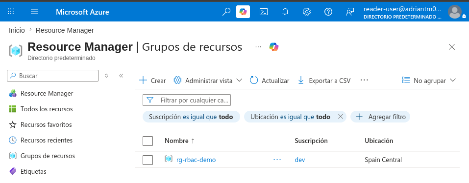

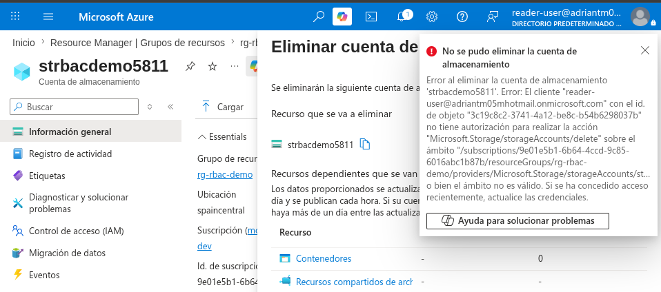

The error message is the win here. It's not silent. It's not generic. It tells the user exactly why they were blocked.

### Contributor has power, but not everywhere

`contributor-user` is the most interesting case. They can do almost anything inside the Resource Group: create storage accounts, delete them, deploy new resources, modify existing ones.

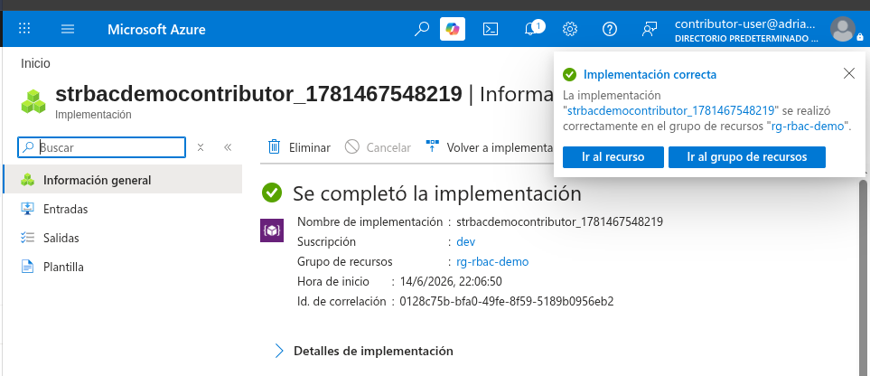

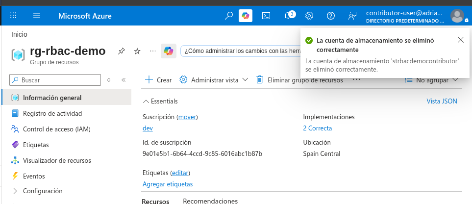

But they cannot read secrets from the Key Vault.

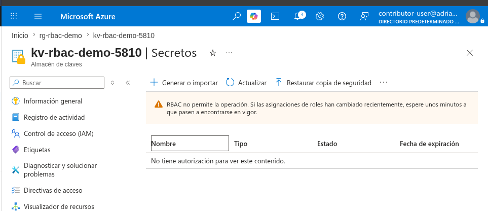

This is the principle that protects production. Operators can manage infrastructure without ever seeing the data flowing through it. That's how you reduce blast radius when credentials leak.

### Key Vault User: minimum viable access

`keyvault-user` was assigned the `Key Vault Secrets User` role at the scope of the Key Vault only. Not the Resource Group. Not the Subscription. Just that one resource.

The result: they cannot see anything in the portal navigation. No resource groups, no storage accounts, nothing.

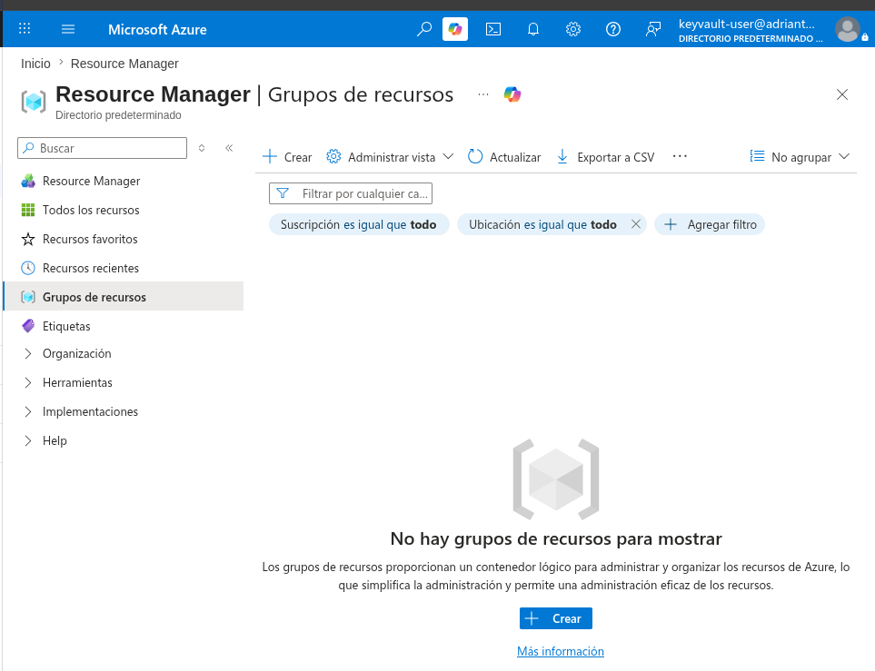

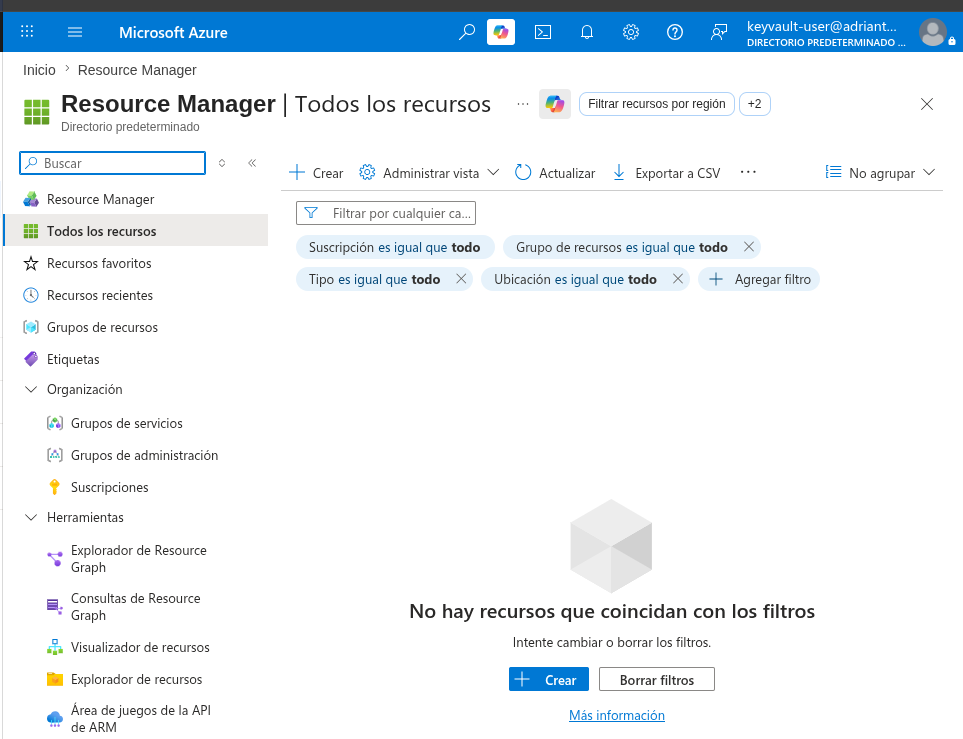

But they can read the secret they need.

This is what an application identity looks like in a well-designed system. A service that needs one secret should have access to that one secret and nothing else.

---

## Design Decisions

**Why Azure RBAC instead of Access Policies for the Key Vault.** Access Policies is the legacy model. RBAC is unified across Azure, integrates with audit logs, and uses the same role assignment model as the rest of the platform. In production, you want one authorization model, not two.

**Why Public network access is enabled.** For this lab, restricting the Key Vault to a private endpoint would require a VNet, a private DNS zone, and a way to test access from inside that VNet. Out of scope for the first project. In production, Key Vault should never be publicly accessible. Private Endpoint or Selected Networks only.

**Why three users instead of groups.** Smaller blast radius for the demo. In production, you assign roles to groups, not individuals. Easier to audit, easier to onboard, easier to revoke when someone leaves.

---

## Key Takeaways

- Owner permissions on a Key Vault do not grant access to its secrets. Management plane and data plane are separate authorization layers.
- RBAC scope matters more than the role itself. A Contributor at Resource Group level has different power than a Contributor at the resource level.
- Least privilege isn't theoretical. It's the difference between an incident and a breach.

---

## Cost

This lab cost less than €1. The Storage Account and Key Vault are essentially free for testing volumes. The biggest expense was the Standard pricing tier of the Key Vault, which is unavoidable for RBAC mode.

---

## What's Next

Project 02 builds on top of this: networking, NSGs, and restricting access to these same resources using Private Endpoints and Service Endpoints. Same security mindset, deeper layer.
