# Network Design by Isolation

A practical demonstration of network segmentation in Azure. Two subnets, two NSGs, one Private Endpoint, one Bastion, and the answer to a question that catches almost everyone: why does `nc -zv` to a "private" SQL Server still say "succeeded" from the public internet?

Spoiler: it's lying. The traffic never reaches your server.

---

## Scenario

A regional fintech startup in Madrid runs its core banking API on a Linux VM and stores customer data in an Azure SQL Database. Today both resources sit in the same Resource Group with public network access enabled, which the company's auditor flagged in the last review. The team needs to isolate the database so that only the API can reach it, while keeping a controlled administrative path for the two engineers who maintain the platform.

Compliance requires zero public exposure of the database. Budget is tight but Azure Bastion is acceptable, since it removes the need for a full VPN. The two engineers work remotely and need occasional SSH access into the API VM, but no public IP is allowed on it.

The default approach in most environments would be to leave the SQL Server with "Selected networks" and a firewall rule pinned to the office IP. This project shows what the right setup looks like when the office IP is not the answer.

---

## Architecture

The setup is one VNet with three subnets: one for the application VM, one for the database's Private Endpoint, and one reserved for Azure Bastion. Two NSGs enforce east-west traffic rules. A Private DNS Zone makes the architecture transparent to the application code.

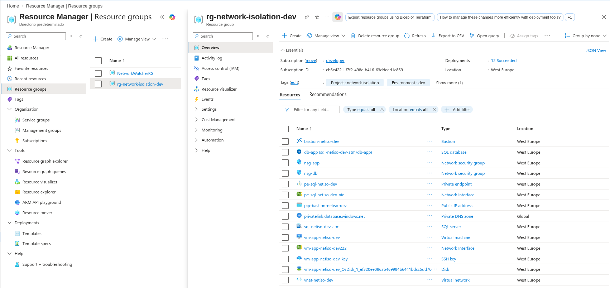

---

## What I Built

| Component | Resource | Purpose |
|-----------|----------|---------|
| `vnet-netiso-dev` (10.10.0.0/16) | Virtual Network | Isolated network for all resources |
| `snet-app` (10.10.1.0/24) | Subnet | Hosts the application VM |
| `snet-db` (10.10.2.0/24) | Subnet | Hosts the SQL Private Endpoint |
| `AzureBastionSubnet` (10.10.3.0/26) | Subnet | Reserved for Bastion service |
| `nsg-app` | NSG | Allows SSH only from Bastion subnet |
| `nsg-db` | NSG | Allows SQL (1433) only from `snet-app`, denies internet outbound |
| `vm-app-netiso-dev` | Ubuntu 24.04 VM | Application server, no public IP, System-assigned MI |
| `sql-netiso-dev-atm` | SQL Server | Public access disabled |
| `db-app` | SQL Database | Hosted on the server |
| `pe-sql-netiso-dev` | Private Endpoint | Network interface of the SQL in `snet-db` |
| `privatelink.database.windows.net` | Private DNS Zone | Resolves SQL FQDN to private IP inside the VNet |
| `bastion-netiso-dev` | Azure Bastion | Browser-based SSH/RDP without exposing the VM |

---

## What Happened in the Lab

### The topology, one subnet at a time

The VNet was designed with three subnets, each isolated for a specific purpose. The application subnet contains only the VM and its NIC. No public IP is attached.

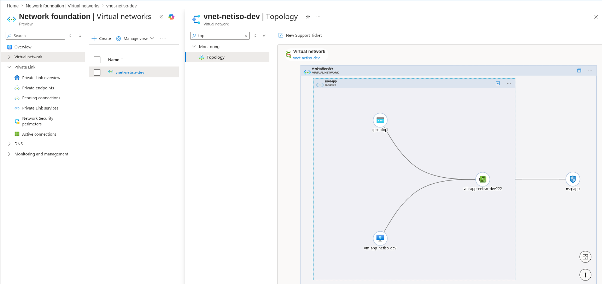

The database subnet contains only the Private Endpoint that fronts the SQL Server. The actual SQL service is managed by Azure but reachable through this NIC, which has a private IP in `snet-db`.

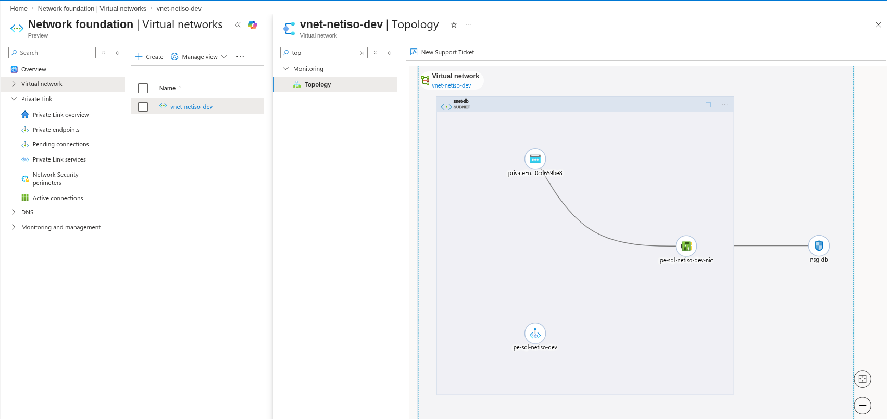

The Bastion subnet hosts the Bastion service. Its name has to be exactly `AzureBastionSubnet`, otherwise the deployment refuses. The subnet uses `/26`, the documented minimum.

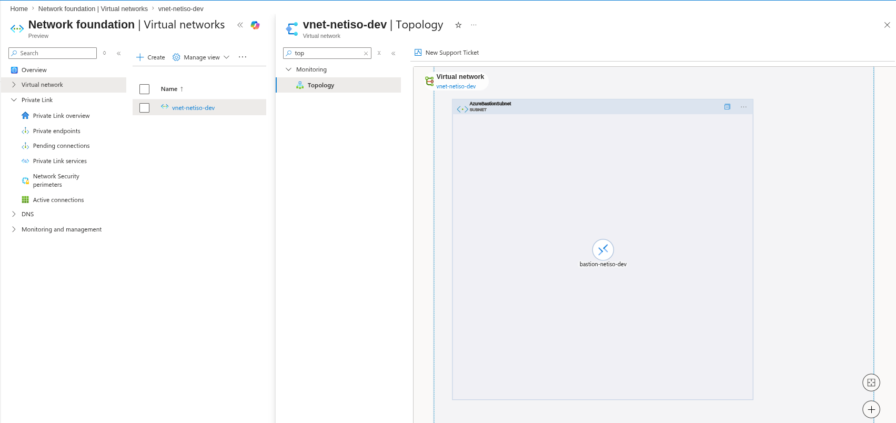

### Two NSGs, two stories

`nsg-app` allows exactly one inbound flow: SSH from the Bastion subnet's address range. Everything else falls through to the implicit `DenyAllInBound`.

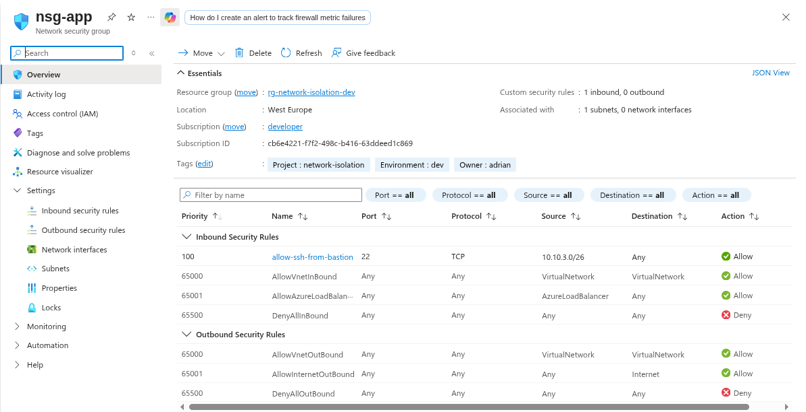

`nsg-db` is more interesting. Inbound, it only accepts TCP 1433 from `snet-app`. Outbound, it explicitly denies traffic to the `Internet` service tag. This second rule is the one that matters in a real breach scenario: even if someone compromises the SQL Server through a vulnerability, they cannot exfiltrate data to an external endpoint.

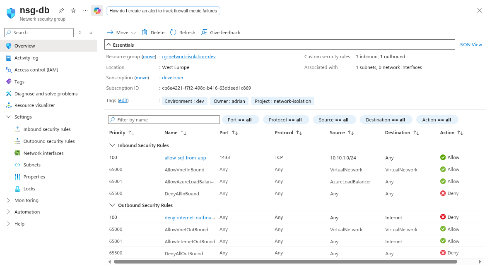

### Public access, gone

The SQL Server is configured with Public Network Access set to `Disable`. No firewall rules. No selected networks. Only approved Private Endpoint connections are accepted.

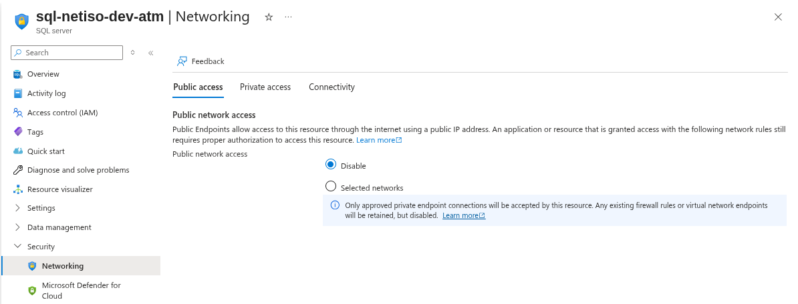

The Private Endpoint creates a network interface inside `snet-db` and binds it to the SQL Server. From the architecture point of view, the SQL Server now has a foot inside the VNet.

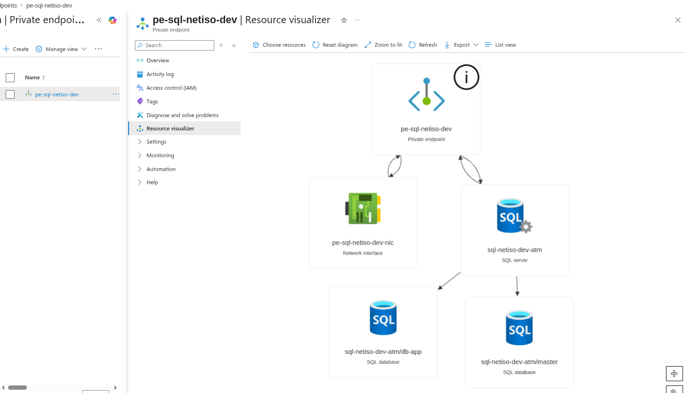

### DNS doing the heavy lifting

The Private Endpoint by itself is not enough. The application connects using the public FQDN (`sql-netiso-dev-atm.database.windows.net`). If that FQDN resolves to a public IP, the connection still tries to go over the internet and fails.

The Private DNS Zone solves this. It is linked to the VNet, and inside the VNet it overrides the public DNS resolution for that specific hostname. The application code does not change. The DNS layer reroutes the traffic.

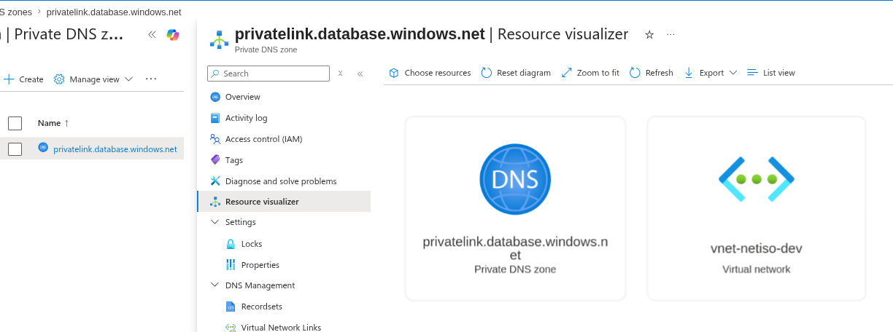

### The VM has no front door

The VM was created in `snet-app` with no public IP. The only way in is through Bastion.

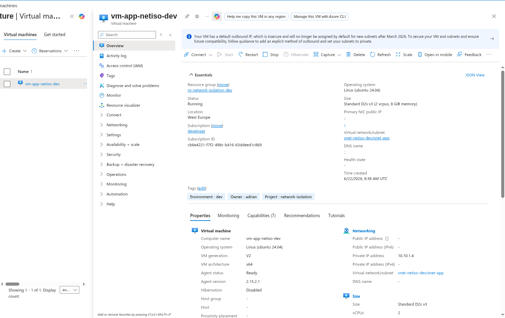

System-assigned Managed Identity was enabled during creation. The VM is not using it for SQL access in this project (SQL authentication is fine for a private setup), but having it ready means any future access to Storage, Key Vault, or other Azure services can be done without secrets.

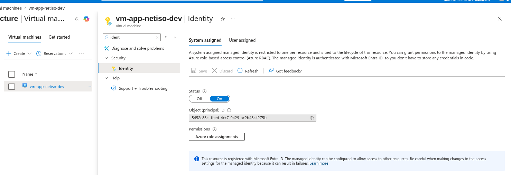

### Bastion: the only way in

Accessing the VM means going through the Azure portal, opening Bastion, and authenticating with the SSH private key generated during VM creation.

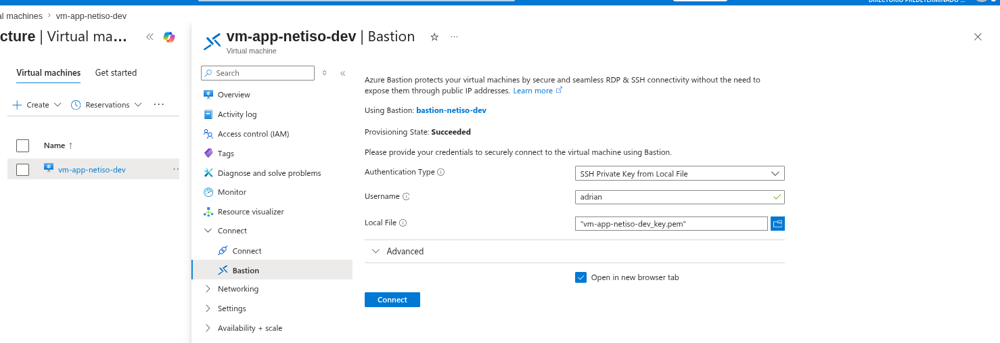

Once inside, the VM has a private IP in the `10.10.1.0/24` range and no path to the public internet from `snet-db`'s side.

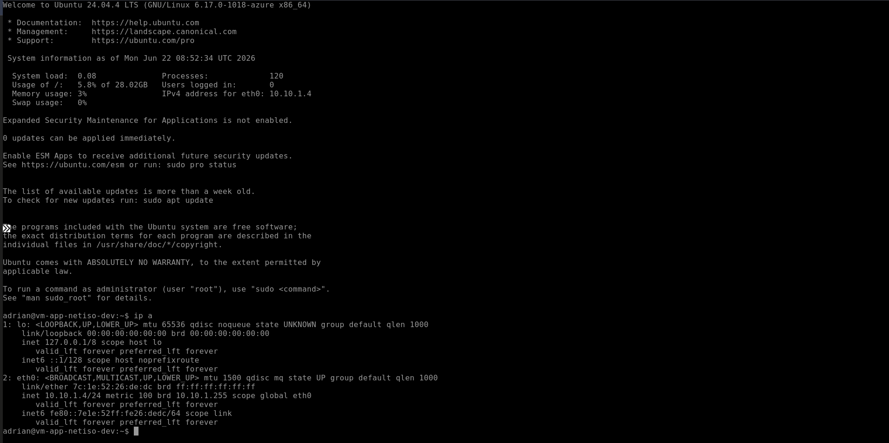

### Verification from inside the VNet

From the VM, resolving the SQL FQDN returns the private IP `10.10.2.4` (inside `snet-db`). The Private DNS Zone is intercepting the lookup as expected. A TCP connection to port 1433 succeeds, going through the Private Endpoint and across the NSGs.

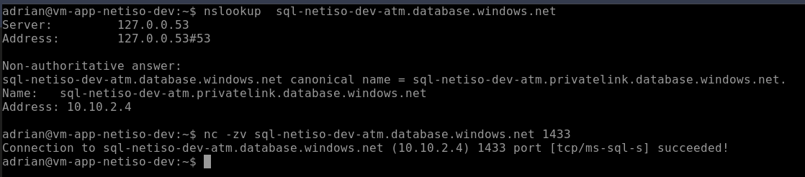

### The surprise: the laptop can "connect" too

The same two commands from my laptop on the public internet return a totally different result. The FQDN resolves through a chain of CNAMEs to `20.61.99.192`, which is a public IP belonging to the Azure SQL Gateway for West Europe. And `nc -zv` to port 1433 also says "succeeded".

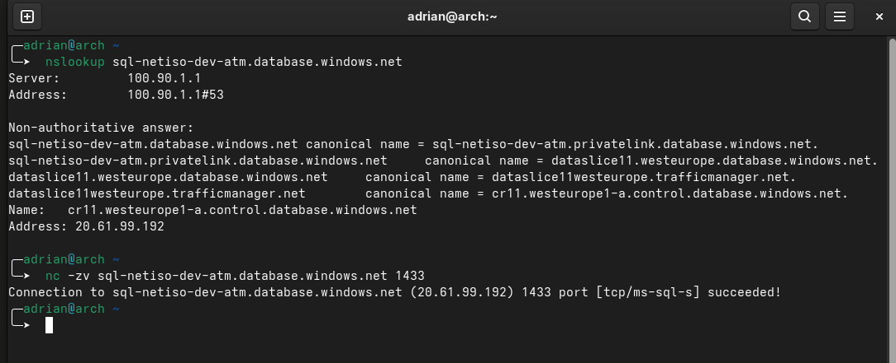

At first glance, this looks like the isolation is broken. It is not.

Azure SQL Database has a two-tier architecture: every connection from the public internet first lands on a shared Azure SQL Gateway, which then decides whether to forward the connection to the actual server. The Gateway is public and always listens on 1433. The TCP handshake completes there, but no real session is established with `sql-netiso-dev-atm` because public network access is disabled at the server level.

The proof: attempting to actually authenticate against the database, even with valid credentials, fails. The Query Editor in the Azure portal is one easy way to demonstrate this. The portal runs outside the VNet, so it goes through the public path. The result is a connection error.

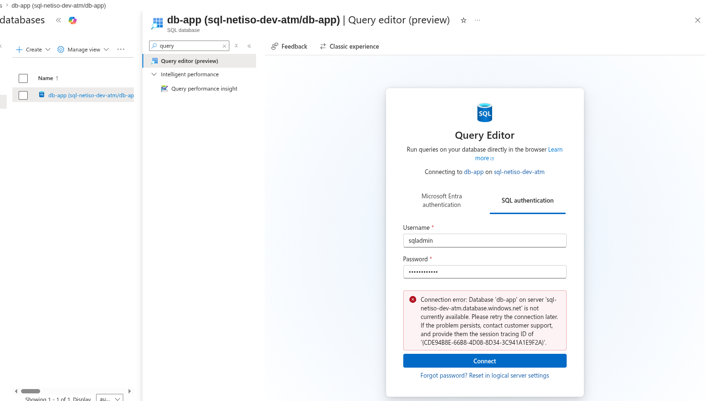

This is the lesson buried in the lab. `nc -zv` is not a security test against Azure PaaS services with gateways. It tells you the gateway is alive. It tells you nothing about whether your traffic reaches the actual resource.

---

## Design Decisions

**Why `/16` for the VNet and `/24` for the workload subnets.** Plenty of room to grow. If a future project needs to peer with this VNet, `10.10.0.0/16` does not collide with the default `10.0.0.0/16` used everywhere else. `/24` per subnet gives 256 IPs of headroom for any service that might be added later.

**Why two NSGs instead of one for the whole VNet.** NSGs are scoped per subnet (or per NIC, but I avoided NIC-level rules here). Splitting them lets each subnet evolve independently. If `snet-db` ever hosts more services, the rules stay focused on that subnet's purpose without inheriting unrelated `snet-app` rules.

**Why deny internet outbound on `snet-db`.** This is the lateral movement defense. The application subnet needs outbound to internet (for OS updates, package installs, Azure CLI). The database subnet does not. If something compromises a resource in `snet-db`, it cannot reach a command-and-control endpoint or exfiltrate data to an external bucket. The implicit `AllowInternetOutBound` rule at priority 65001 is overridden by an explicit `Deny` at priority 100.

**Why Private Endpoint instead of Service Endpoint.** Service Endpoints route traffic over the Azure backbone but the resource still uses its public IP. Private Endpoint gives the resource a real private IP inside your VNet. For SQL Database in 2026, Private Endpoint is the recommended pattern, and it is the only way to fully disable public access while keeping the resource reachable from inside the network.

**Why Azure Bastion Basic SKU.** The Standard and Premium tiers add features (native client, IP-based connectivity, session recording) that are not needed for a two-engineer team. Basic at around 140 EUR per month is justified by removing public IPs from production VMs. Cheaper than a full VPN gateway and zero client-side setup.

**Why System-assigned Managed Identity on the VM, even though I don't use it here.** Future-proofing. The day the VM needs to read from Storage or Key Vault, the identity already exists. Activating it later forces a VM restart. Activating it at creation is free.

**Why a single Private DNS Zone resource for `privatelink.database.windows.net`.** All future SQL Servers in this VNet will share the same zone. The zone is the routing decision; the records inside it are per-endpoint. One zone is simpler to maintain than one per server.

---

## Key Takeaways

- DNS is part of the security perimeter. Without the Private DNS Zone linked to the VNet, the Private Endpoint exists but is unreachable by hostname.
- `nc -zv` to an Azure PaaS service is not a meaningful isolation test. The TCP handshake hits the regional Gateway, not your resource. Always validate with an actual authenticated session.
- NSG outbound rules matter as much as inbound ones. Most breaches do damage after the attacker is inside; blocking lateral and outbound movement is what limits the blast radius.
- Public Network Access disabled is stronger than firewall allow-lists. Allow-lists are a list of IPs that change. Disabled is a binary state that cannot be subverted by IP spoofing or shared infrastructure.

---

## Cost

The lab cost around 2 EUR for the half-day session.

- VNet, NSGs, Private DNS Zone: free.
- SQL Database in Serverless General Purpose with auto-pause: a few cents while idle, a few more while connecting.
- VM Standard_D2s_v3: around 0.10 USD per hour while running.
- Azure Bastion Basic: prorated from 140 EUR per month, so cents for the lab duration.
- Public IP for Bastion: nominal charge.

The Resource Group was destroyed after capturing screenshots.

---

## What's Next

Project 03 takes the same security mindset down to the storage layer: lifecycle policies, redundancy choices, tiering, and how cost-aware design is its own form of governance.
