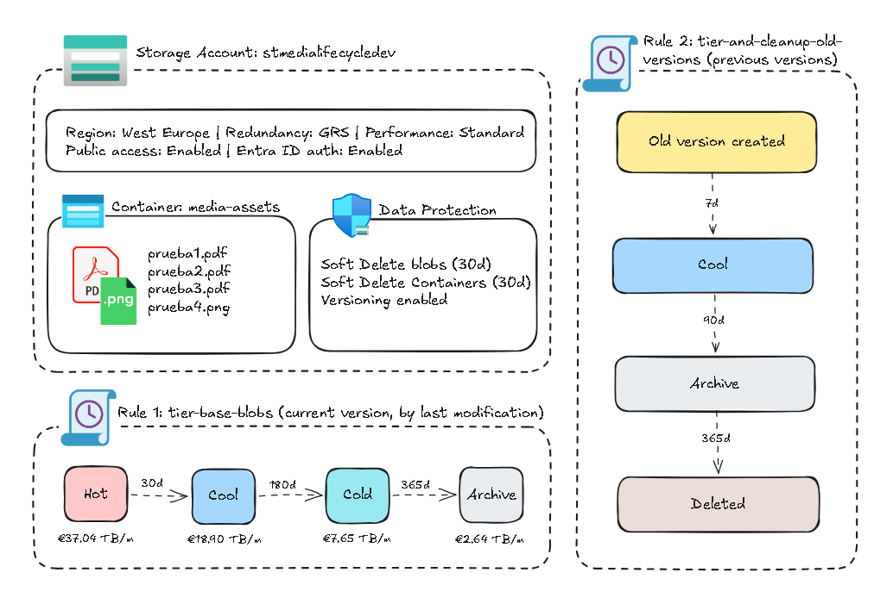
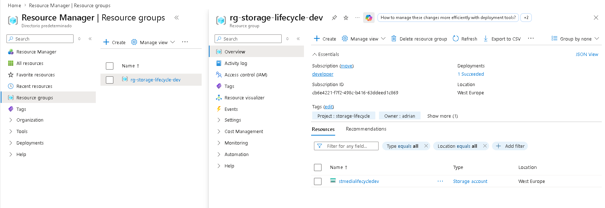
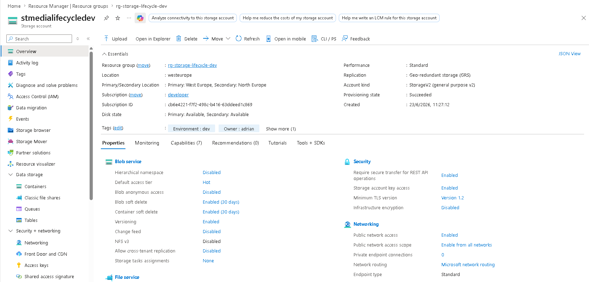
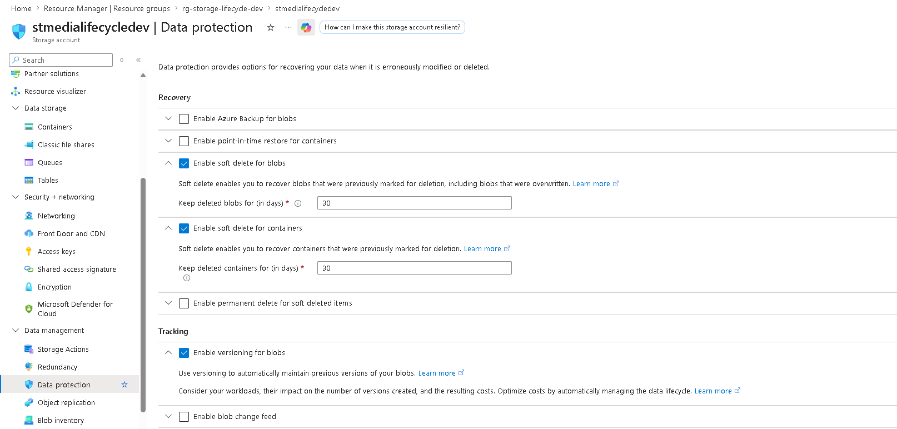
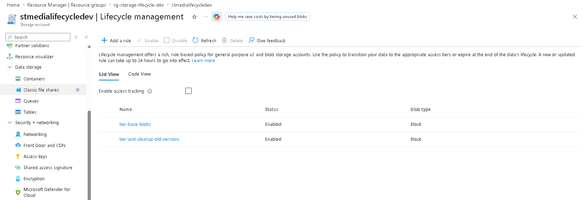
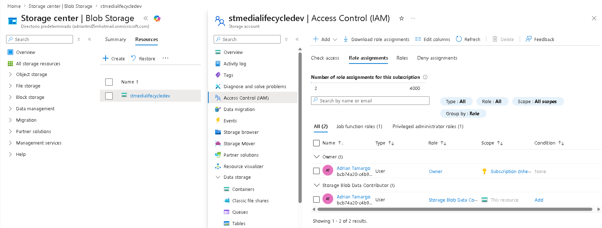
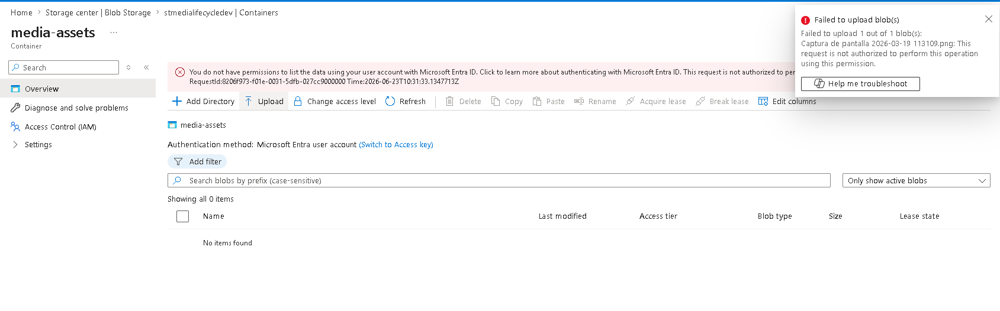
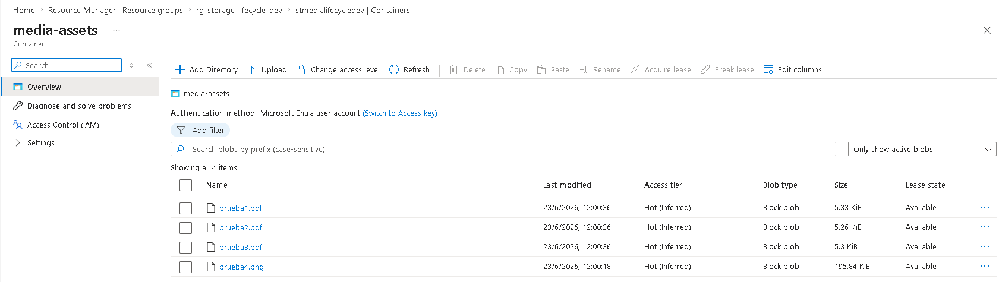
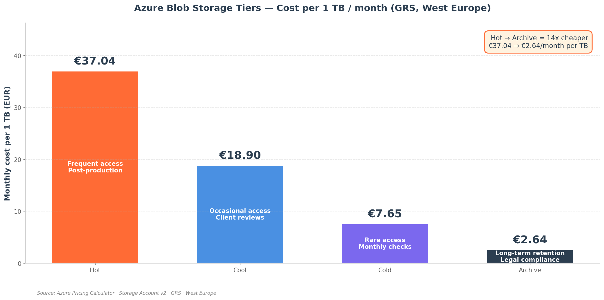

# Storage Design by Lifecycle

A practical demonstration of cost-aware storage design in Azure. Four tiers, two lifecycle rules, one seven-year retention requirement, and the answer to a question CFOs keep asking: why does the storage bill keep growing if no one is uploading anything new?

Spoiler: because nobody set up tiering.

---

## Scenario

A media production studio in Valencia stores raw footage and finished edits in Azure Blob Storage. Recently uploaded files are accessed constantly during post-production. One month after delivery, access drops to occasional client reviews. After one year, files are barely touched but must be retained for seven years by contract. The CFO is asking why the storage bill keeps growing despite the projects being closed.

The challenge is to design a storage strategy that meets the retention requirement, optimises cost based on the access pattern, and survives a regional outage without breaking the contract.

The default approach in most environments would be to leave everything in the Hot tier and add storage as it grows. This project shows what the right setup looks like when the access pattern is known and the contract is binding.

---

## Architecture

One Storage Account with GRS redundancy. One container hosting all media assets. Two lifecycle rules: one that tiers down current blobs as they age, another that cleans up old versions after their useful life ends. Soft delete and versioning enabled for accident recovery.

---

## What I Built

| Component | Resource | Purpose |
|-----------|----------|---------|
| `rg-storage-lifecycle-dev` | Resource Group | Container for all project resources |
| `stmedialifecycledev` | Storage Account (GPv2, Standard, GRS) | Block blob storage with regional resiliency |
| `media-assets` | Blob container | Holds raw footage, edits, and archived deliverables |
| Soft delete (blobs + containers) | Data protection | 30-day recovery window for accidental deletes |
| Versioning | Data protection | Automatic version history for overwrites |
| `tier-base-blobs` | Lifecycle rule | Tiers current blobs: Hot → Cool → Cold → Archive |
| `tier-and-cleanup-old-versions` | Lifecycle rule | Tiers and deletes old versions |

---

## What Happened in the Lab

### The storage account, configured for the long haul

The Storage Account was created in West Europe with GRS redundancy. Public network access stays enabled for the lab (in production it would go behind a Private Endpoint, same pattern as the SQL Server in project 02). Default access tier is Hot, since freshly uploaded footage is touched constantly during post-production.

### Data protection that costs almost nothing

Three protections were enabled: soft delete for blobs (30 days), soft delete for containers (30 days), and versioning for blobs. Together they cover the most common operational mistakes: accidental deletes, accidental overwrites, and accidental container drops.

The trade-off these features carry is real: soft delete keeps the deleted data billed during the retention window, and versioning multiplies storage costs by the number of historical versions per blob. For workloads where the same blob is rewritten hundreds of times a day, this gets expensive. For media footage that gets uploaded once and rarely overwritten, the cost is negligible and the safety net is huge.

### Two lifecycle rules, one philosophy

The lifecycle policy was built around two distinct concerns. Current blobs (the active version of each asset) move down the tier hierarchy as access frequency drops. Old versions (created automatically by the versioning feature) get tiered more aggressively and deleted after a year, because keeping an unlimited history of edits would defeat the cost optimisation.

The rules transition base blobs from Hot to Cool at 30 days, Cool to Cold at 180, and Cold to Archive at 365 days from last modification. Previous versions get sent to Cool at 7 days, Archive at 90, and deleted at 365. The full policy JSON lives in [`documents/lifecycle-policy.json`](./documents/lifecycle-policy.json).

### The blobs land in Hot, as expected

A handful of PDFs and a PNG were uploaded to `media-assets`. All four landed in the Hot tier because that is the default access tier of the Storage Account. From this moment on, the lifecycle policy is the only thing moving them.

### The data plane bites again

The first upload attempt failed with `"This request is not authorized to perform this operation using this permission"`. The cause is the same one from project 01, applied to a different service: being Owner of the Storage Account at the management plane does not grant data plane access to the blobs themselves.

Adding the `Storage Blob Data Contributor` role at the Storage Account scope fixed it. After waiting for RBAC propagation (a couple of minutes), the upload succeeded.

What made this happen by default was a setting toggled during Storage Account creation: `Default to Microsoft Entra authorization in the Azure portal`. With that on, the portal stops falling back to the account access key and requires you to authenticate as a real RBAC-controlled identity. It is the right setting in production, even if it forces the operator to apply least privilege to themselves.

---

## Cost Analysis

The whole point of this design is that storage cost is not a single number. It depends on which tier the blob lives in. For 1 TB stored continuously in West Europe with GRS redundancy:

A blob that lives its whole life in Hot costs around 37 EUR per month. The same blob in Archive costs 2.64 EUR per month. That is a 14x reduction without changing anything except the tier label. Apply that to a 50 TB archive of finished projects sitting untouched in Hot, and the monthly bill drops from around 1,850 EUR to around 132 EUR.

The catch is rehydration. Archive tier blobs cannot be read directly. They have to be moved back to Hot or Cool first, which takes up to 15 hours with standard priority and costs both per-GB retrieval fees and per-10,000-operations fees. For a contract that says "keep this for seven years but you will probably never look at it", that latency is the right trade. For a database backup that the on-call engineer might need at 3 AM, it is the wrong tier.

---

## Design Decisions

**Why GRS instead of ZRS.** The scenario explicitly mentions surviving a regional outage. ZRS protects against the loss of a single Availability Zone within a region, but a full region failure (the one that makes Twitter trend) takes ZRS down with it. GRS replicates asynchronously to the paired region (West Europe to North Europe), so the data survives. Both regions are in the EU, so the residency requirement holds. The cost difference is around 25 EUR per TB per month, which is justified for a seven-year retention contract where a single region loss would be a contract breach.

**Why GRS and not GZRS.** GZRS combines both protections at roughly 150% the price of LRS. For media files that are not actively served to the business, the extra zone-level resilience inside the primary region is hard to justify. GRS is the defensible choice for the budget profile in the scenario.

**Why `daysAfterModification` and not `daysAfterLastAccess`.** Last-access tracking requires an additional feature toggle that updates blob metadata on every read, which adds per-operation cost. The access pattern in this scenario is predictable (upload, edit for a month, archive), so timing by modification is both cheaper and good enough. Last-access tracking is the right choice for less predictable workloads, like a library of assets where reads are unpredictable and you want the tier to adapt automatically.

**Why versioning is on even with the cost overhead.** Media files are large but they are not rewritten often. The number of historical versions per blob will stay low in practice. The cost of having protection against accidental overwrites is small, and lifecycle rules clean up old versions after a year so the cost is bounded.

**Why all blobs live in one container instead of one per project.** Lifecycle rules in Azure apply to the Storage Account level and can filter by prefix. A single container with a clear naming convention (`projectname/yyyy/`) is simpler than dozens of containers and gives the same flexibility. In production with hundreds of projects, prefix-based rules would split them into different tier paths.

**Why public network access stays on.** Same reasoning as project 02 inverted: in this lab the focus is lifecycle and tiering, not network isolation. In production the Storage Account would either use selected networks or a Private Endpoint. The pattern was already demonstrated in project 02.

**Why "Default to Microsoft Entra authorization in the portal" is on.** The portal becomes consistent with how production access should work: identities, roles, RBAC. The access keys still exist for break-glass scenarios, but they stop being the default. The trade-off is that the operator gets surprised when their Owner role does not unlock blob reads. That surprise is the lesson.

---

## Key Takeaways

- Storage cost optimisation is mostly about tiers, not about deleting data. A 14x cost reduction lives in the difference between Hot and Archive for the same exact data.
- Management plane and data plane are separate in every Azure service, not just Key Vault. Owner of a Storage Account cannot read blobs without an explicit data plane role.
- Lifecycle policies are declarative and idempotent. They take up to 24 hours to evaluate for the first time, so testing means waiting or trusting the JSON.
- "Default to Entra authorization" is one of those settings that looks pedantic until it forces you into the right habits.
- Redundancy is not a default. It is a contract decision. The right tier depends on what a region outage would mean to the business.

---

## Cost

The lab itself cost a few cents. A new Storage Account with a few small blobs sitting in Hot for half a day is negligible. The Resource Group was destroyed after the screenshots were taken.

The interesting cost is the one in the analysis section above: the comparison between tiers at 1 TB scale, which is what would actually drive the production design.

---

## What's Next

Project 04 takes the same mindset into the business continuity layer: backup, replication, RPO and RTO. Storage tiering protects against cost. Business continuity protects against everything else.
